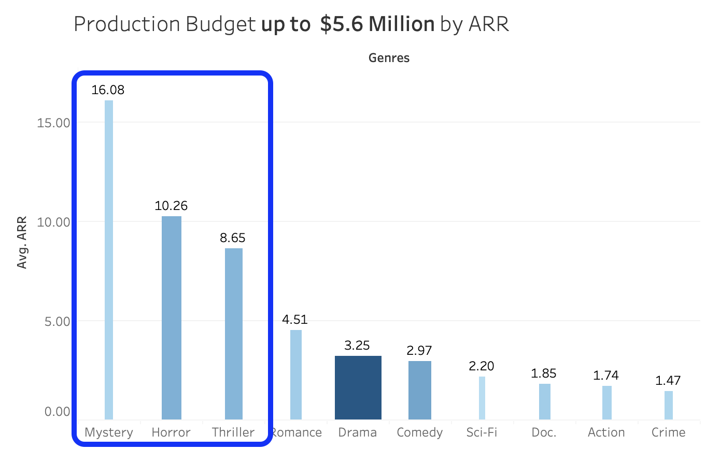
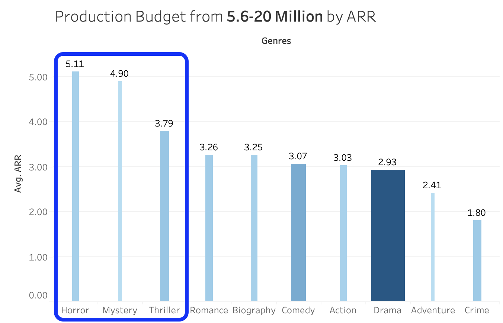
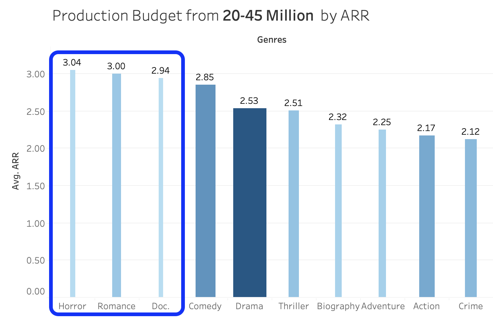

# DSC-Phase2-Project2

## Business Understanding

- Stakeholders: a company wanting to enter the orginail video content creation space by opening a new movie studio.

- Task: Identify which types of films are currently the most successful and summarize these findings for stakeholders.

## Data Understanding

The data explored for this task came from two sources:

- [The Numbers](https://www.the-numbers.com/): A film data website which provided production budgeting information and worldwide gross revenue estimations for the films we analyzed. This website is operated by [OpusData](https://www.opusdata.com/home.php), and it allows access to all the financial film data via its web-based API.
    - The data from this website was stored in a csv file - '../unzippedData/tn.movie_budgets.csv' - that is linked below and included in our repository for reference.

- [IMDb](https://www.imdb.com/): A website that functions to gather and present information about the success of films based on metrics like ratings, while also contributing categorical metrics such as attributing directors to films and connecting principal actors to their work. We utilized this website to categorize films into their appropriate genres as well as to identify the directors that worked on each of the films.
    - The data from IMDb is stored as a SQL database and can also be found in our repository for refernce. We access it below using the following path: '../unzippedData/im.db'

## Data Preparation

- To begin this project, we will import all necessary python libraries that will be utilized throughout the notebook. Then we will access our data via connecting to the data files stored in our repositroy. 

# Recommendations

# Conclusions