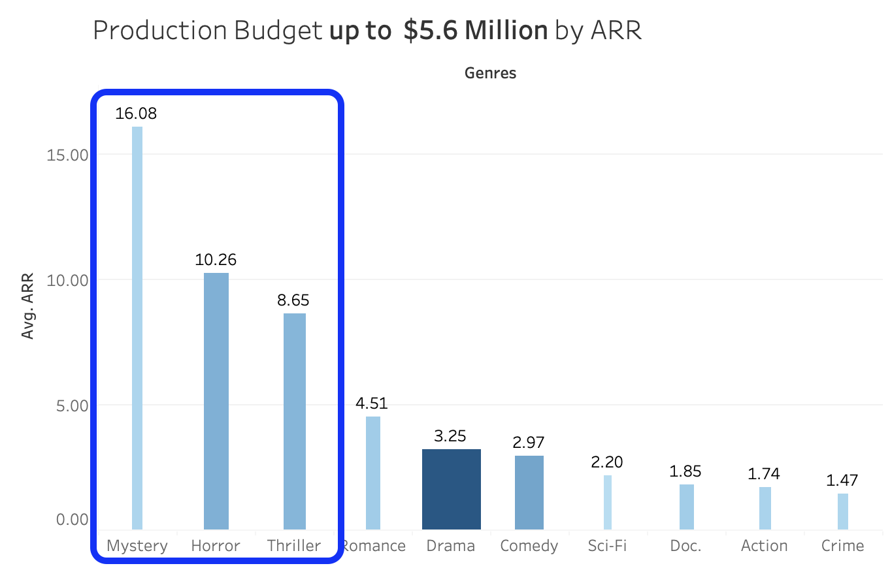
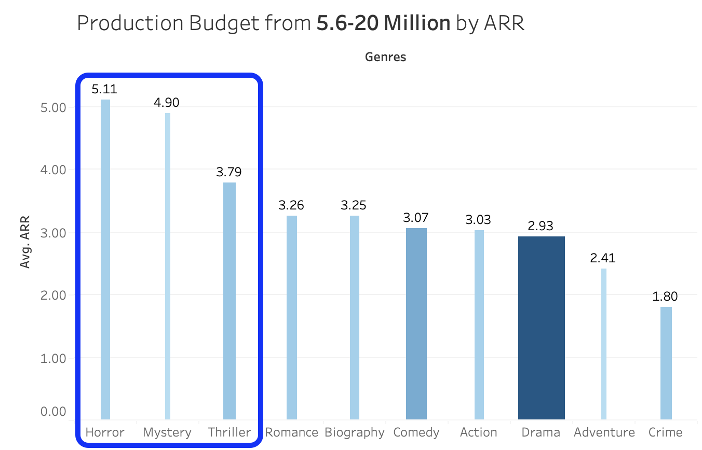
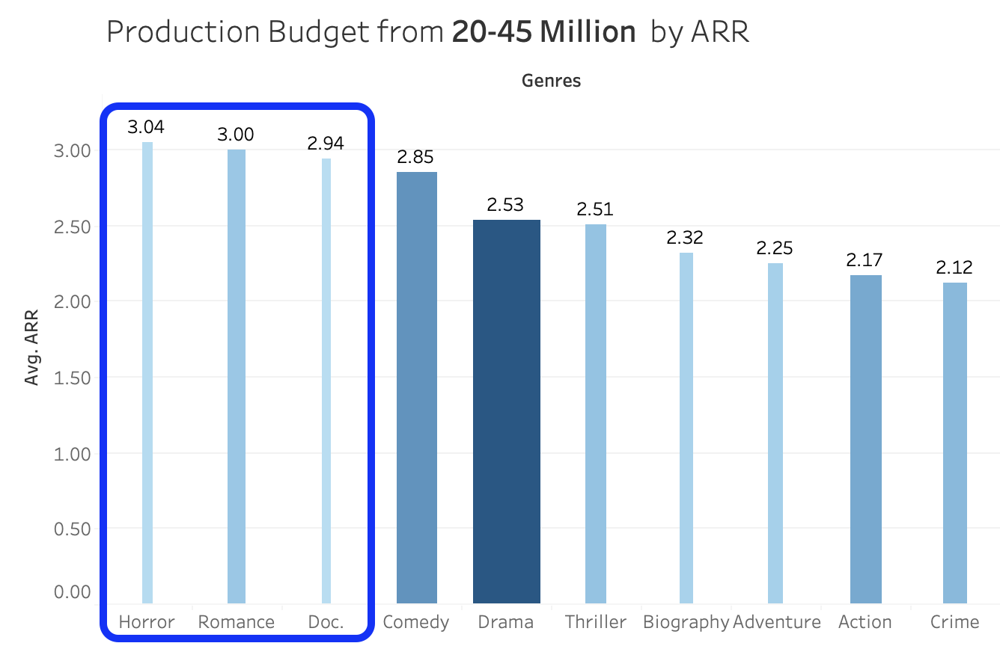

# Box Office Analysis

**Authors**: Claire Sarraille, Sam Whitehurst & Nick Tjandra


## Overview

Our company is seeking to enter the film making industry by opening a new movie studio. Specifically, our company is looking to make movies with a high return using a relatively lean budget. We will make our recommendations based on data analyzed from IMDb and The Numbers datasets. 

## Business Understanding

Our team has decided on three budget tiers and will make our recommendations around them. We have identified the top performing movie genres and top directors to make the movie with the highest possible return for each budget tier.

## The Data

The data explored for this task came from two sources:

- [The Numbers](https://www.the-numbers.com/): A film data website which provided production budgeting information and worldwide gross revenue estimations for the films we analyzed. This website is operated by [OpusData](https://www.opusdata.com/home.php), and it allows access to all the financial film data via its web-based API.
    - The data file from this website is stored in our repository for reference.

- [IMDb](https://www.imdb.com/): A website that functions to gather and present information about the success of films based on metrics like ratings, while also contributing categorical metrics such as attributing directors to films and connecting principal actors to their work. We utilized this website to categorize films into their appropriate genres as well as to identify the directors that worked on each of the films.
    - The data from IMDb is stored as a SQL database and can also be found in our repository as well.


## Data Preparation

We began the project by importing all necessary python libraries and reading in the data described above.

For the IMDb dataset, we reviewed the following ERD visual, which allowed us to recognize how each of the tables are connected via designated keys.


### Data Cleaning
Through the creation of the various functions detailed below, we were able to scrub the data from our various sources. Cleaning the data allowed us to run aggregating functions in the later stages of our data analysis. Specifically, we created three functions that helped to quickly clean columns and headings of our data throughout our project. These functions were applied to The Numbers dataset:

- Function 1: for cleaning numbers column, removing unnecessary characters and casting the column as integers.

- Function 2: for cleaning column headers.

- Function 3: for cleaning comma seperated string values of a series into list of strings. Accepts one series.

## Data Analysis

### Analysis Overview:
This overview provides a glimpse at the thinking behind each of the steps we performed at the analysis stage of the project:

1. Identify which metric best measures the "success" of a particular film.

2. Explore the different options available to categorize films (using genre classification or decade, etc). 

3. Developing a strategy to present this data to the stakeholders. 

4. Grouping our data by range of initial investment corresponding to the level of initial risk incurred by the studio.

### Conducting the Analysis:

#### 1. Measuring Film Success
Using The Numbers dataset, we identified the columns 'Worldwide Gross' revenue and 'Production Budget' as the key metrics that we could use in our analysis. Each record in the dataset corresponds to a unique film and it includes the date of release for that film. 

We engineered two columns: 'Profitability' and 'ARR':
 - First we created the column 'Profitability' to gain insight on exactly how much money was earned by each film. The equation for this column subtracts the 'Production Budget' or the cost to create the movie from the revenues earned which is stored in the 'Worldwide Gross' column for each film.
  
    - We determined that we could not rely on this metric alone, as this film data spans many decades and there is no indication that the financial figures provided have been adjusted for inflation.

- Next we decided to engineer a ratio between the revenues earned worldwide and the cost to create the movie. 

    - This engineered ratio allows us to ignore additional (and potentially inaccurate) inflation adjustments over time, as each film incurred costs and revenues in its own time, so the 'Worldwide Gross' and 'Production Budget' values may be combined and analysed without additional scaling.

Release Date Filter:

- Our next step was to clean the Release Date column. We determined that the month and day information was too granular for our analysis at this stage, so we isolated the release year associated with each film.

Eliminate Films before 1990:

- Looking at our year values, we determined that many of the films before 1990 acted as outliers in our analysis. Ultimately, we determined that our stakeholders are seeking analysis on more current trends in the film industry, so we eliminated the films from before 1990 from our dataset.

#### 2. Exploring Categorization Options for Films and Merging our Datasets.
Within the IMDb dataset, we identified the 'genres' column contained in the 'movie_basics' table and the names of all the directors associated with each film in the 'directors column, which we will integrate later. 

We first connected to the 'movie_basics' table and applied our data cleaning functions to standardize the 'genres' column like we did before for The Numbers dataset. Then we reconfigured the dataset as a pandas DataFrame, allowing us to more easily manipulate and merge the data with our exisiting dataset. Column headers were changed in order to match our existing dataset's headers, allowing us to join our datasets on this shared header appropriately.

The IMDb data contains many more movies than we have financial information for in The Numbers dataset. We determined that we would only analyze films with sufficient financial data. 

Because the 'Genres' column categorizes some of the films in multiple genres and also contains null values, further data cleaning was required.

- We determined that a film falling into multiple genres needs to be counted for each respective genre that it belongs to, as the film can be duplicated along the genre categorization, without duplicating any of the financial metrics. This is because we do not combine genres via addition or any other equation throughout the rest of our analysis. 

- Then we dropped null values, as we are not able to analyze the films that are missing this key data point.

#### 3. Strategizing how to Present our Findings to the Stakeholders.

We explored which film genres on average produces the highest return on investment by various methods that grouped the genre categories and then calulated the mean ARR values for each genre.

We determined that the range of budgets within the 'Production Budget' column was too wide to compare these film genres accurately, so we decided to create 4 distinct bins defined by the quartiles of the 'Production Budget' column. These bins represent 4 investment ranges that can be considered more risky as the amount of funds invested increases. 

Our analysis determined our 4 risk level production budget investment ranges based on the quartiles of the 'Production Budget' column:
- Level 1: 0 - 5,575,000
- Level 2: 5,575,000 - 20,000,000
- Level 3: 20,000,000 - 45,000,000
- Level 4: 45,000,000+

We ran some exploratory analysis to see how many films are in each genre.

Next, we analyzed each genre's average return ratio based on the initial investment, sorted in a descending manner. We concluded that the ARR ranking is affected by the many genres that only had a few films contributing to the average return ratio calculation, thus these genres did not have adequate evidence to support their ARR's.

Because this initial ARR calculation accounts for the entire range of production budgets, we felt that presenting this data alone would not be sufficient or fully accurate for our stakeholders. So, we decided to group our film genres by ranges of production budgets or initial investments made/risk taken to make these films by the production companies.

Example 1: the 'Horror' genre has the second highest ARR, and the third lowest average production budget overall. This would suggest that this genre is relatively less risky than almost all of the other genres to produce and it appears to result in almost the highest return on that investment. 

Example 2: Adventure movies are the most expensive to make and their return on investment is ranked 11th in the overall analysis. This means, that Adventure movies require a large initial investment, which a new studio may not choose to risk for its early ventures. 

#### 4. Determing Risk Level Ranges

We used to IQR from The Numbers 'Production Budget' column to determine to bound our risk levels.
This spread includes as many datapoints as we had available to us in The Numbers dataset, therefore offering the most accurate spread of the industry production budget data that we could access. 

#### Binning the datasets based off our investment risk levels.

After our initial splitting binning of the data, we ran another value counts on the films at this risk level to get a sense for the distribution of films at this risk level.

#### Setting the median as a parameter for genres to continue to be relavant to our analysis.
After this inital exploration, we determined that genres with fewer films were appearing higher in the ARR calculation, though their ARR may not be accurately weighted due to a smaller count. 

We decided to set a parameter to eliminate any film genres that had a count equal to or less than the median at each level, this effectively eliminated 11 film genres per risk level and left only the top ten film genres with the most data points contributing to their ARR.

For example: the Biography genre has the 4th highest ARR with only 23 films as compared to the Romance genre which has the 7th highest ARR but 78 films. The difference in ARR's between these two genres is ~.26, however with Romane producing 55 more films, it would appear that Romance is less risky as the data supports the fact that it is more likely that producing a Romance film will result in this relatively high ARR.

Our code demonstrates how this has changed our final values to reflect genres with a high count (greater than the median) of films and a high ARR.

#### Running a linear regression to further support our ARR calculations.

Next, we wanted to further support our analysis resulting in a top three films at this category of Mystery, Horror, and Thriller, resepctively. 

We calculated a linear regression for each risk level and have displayed the resulting coefficients below. The coefficient values do not match the ARR values above, but we did not expect them to match perfectly. Rather, we were interested in the relative order of the coefficients, as a higher coefficient represents a higher weighting of that genre, and thus a likelihood that that genre will consistently produce a higher ARR.

Mystery, Horror, and Thriller had the highest coefficient values. 

We looped through each of the 3 remaining risk levels next. We performed all of the same calculations for each of the risk levels, so to save space we have not copied our Markdown again for each risk level, as the logic remains the same. Comments have been included in the code cells for a brief reminder.


# Data Summary

- At Risk Level 1 ($0 - $5,575,000): the film genres with the highest ARR are: Mystery, Horror, Thriller. The relative order of these films is further supported by our linear regression analysis which produced coefficients with magnitudes that aligned with the ARR calculation ordering.



If this new studio chooses to invest less than $5,575,000 then the data shows that the studio has an opportunity to make a return on their investment at a factor of 16.08 if they were to make a Mystery film.

- At Risk Level 2 ($5,575,000 - $20,000,000): the film genres with the highest ARR are: Horror, Mystery, Thriller. Our linear regression supported this conclusion again.



If the new studio chooses to invest between $5,575,000 and $20,000,000, then the data shows the studio has an opportunity to make a return on their investment at a factor of 5.11 if they were to make a Horror film.

- At Risk Level 3 ($20,000,000 - $45,000,000): the film genres with the highest ARR are: Horror, Romance, Documentary. Our linear regression supported this conclusion again.



If the new studio chooses to invest between $20,000,000 and $45,000,000, then the data shows the studio has an opportunity to make a return on their investment at a factor of 3.04 if they were to make a Horror film.

- At Risk Level 4 ($45,000,000+): the film genres with the highest ARR are: Animation, Sci-Fi, and Adventure. Our linear regression supported this conclusion again.

If the new studio chooses to invest more than $45,000,000, then the data shows the studio has an opportunity to make a return on their investment at a factor of 3.88 if they were to make an Animated film.


### Top Directors by Risk Level:
- When we drilled down into Risk Level One, looking at each of the top 10 films by ARR, we found that some of the top directors are all associated with the same studio that mae The Gallows, Paranormal Activity and insidious. 7/10 of these top 10 films are [horror/mystery/thriller] or horror.

#### Level 1:


#### Level 2:


#### Level 3:


# Recommendations

- Produce Horror films at any of the first three budget levels.

- Top directors at the first Risk Level: Chris Lofing, William B. Bell, Jordan Peele 

- At higher risk levels, consider additional genres like Romance and Animation.

- At highest risk level, best performing genres are animation, sci-fi and adventure

# Next Steps

- Explore top genres in higher risk levels (>45 mill)

- Use multi-genre to fine-tune (i.e. horror-mystery-comedy)

- Identify winning actor/director combos

# Presentation and Additional Links:

- [Presentation Slide Deck](Presentation.pdf)

- [Tableau Dashboard](https://public.tableau.com/app/profile/claire.sarraille/viz/MovieBudgetRiskAnalysis/BudgetbyGenre?publish=yes)


#### Repository Structure Diagram
```
├── LICENSE
├── README.md
├── csv_exports_for_tableau
│   ├── directors.csv
│   ├── movie_basics.csv
│   ├── movie_genre_directors.csv
│   ├── movie_risk_NO_genre.csv
│   ├── movie_risk_genre.csv
│   └── persons.csv
├── images
│   ├── movie_data_erd.jpeg│   
    ├── risk_level_graphs│   
        ├── level_1.png
        ├── level_2.png
        ├── level_3.png
│   ├── oldHollywood.jpg
│   └── top_directors_L1.png
│   └── top_directors_L2.png
│   └── top_directors_L3.png
├── Final_Notebook.ipynb
├── notebooks
│   ├── EDA - Sam.ipynb
│   ├── EDA IMDB - Nick.ipynb
│   ├── EDA IMDB - Sam.ipynb
│   ├── EDA TN.MovieBudget - Nick.ipynb
│   ├── EDA TN.MovieBudget - Sam Risk Bins by Production Budget.ipynb
│   ├── OLD_Movie Budget Risk Analysis.ipynb
│   └── claire_dev
│       ├── imdb_persons_cleaning.ipynb
│       └── tableau_data_prep.ipynb
└── zippedData.zip
```
